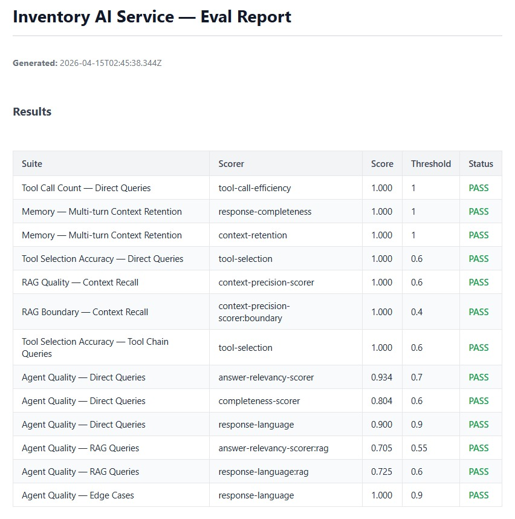

# inventory-ai-service

AI microservice built with **Mastra 1.24.1** and **TypeScript** — RAG with pgvector, a tool-calling agent with 17 tools, MCP server (stdio + HTTP streaming), agent memory, automated evals, and a public streaming chat UI. Connected to a real inventory management system.

[](https://github.com/nicolerol28/inventory-ai-service/actions/workflows/evals.yml)


---

## Ecosystem

| Project | Repo | URL |
|---------|------|-----|
| **AI Service** (this repo) | [inventory-ai-service](https://github.com/nicolerol28/inventory-ai-service) | Railway |
| **Inventory Backend** | [inventory-system-backend](https://github.com/nicolerol28/inventory-system-backend) | Railway |
| **Inventory Frontend** | [inventory-system-frontend](https://github.com/nicolerol28/inventory-system-frontend) | [inventory.nicoleroldan.com](https://inventory.nicoleroldan.com) |
| **Chat UI** | [inventory-ai-chat](https://github.com/nicolerol28/inventory-ai-chat) | [chat.nicoleroldan.com](https://chat.nicoleroldan.com) |

---

## Tech Stack

| Layer | Technology |
|-------|-----------|
| Runtime | Node.js 22 + TypeScript |
| AI Framework | Mastra 1.24.1 |
| LLM | Gemini 2.5 Flash |
| Embeddings | Gemini Embedding 001 |
| HTTP Server | Hono |
| Database | PostgreSQL + pgvector (Railway) |
| Agent Memory | Mastra PostgresStore + observationalMemory |
| MCP | `@mastra/mcp` — stdio & HTTP streaming |
| Evals | `@mastra/evals` + Vitest |
| Auth | JWT validation |
| CI | GitHub Actions |

---

## Project Phases

| Phase | Description | Status |
|-------|-------------|--------|
| 1 | Manual RAG with embeddings (cosine similarity from scratch) | 
| 2 | Real RAG with pgvector + `EmbeddingRepository` | 
| 3 | Agent with 17 tools (products, stock, movements, catalog, reports) | 
| 3.5 | MCP server — stdio for Claude Desktop, HTTP streaming for Mastra Studio | 
| 4 | Agent memory — `PostgresStore` + `observationalMemory` | 
| 5 | Automated evals — 4 test suites, 55 cases, HTML report, CI with GitHub Actions | 
| 6 | Backend: conversation CRUD, rate limiting, daily seed job, hexagonal refactor · Frontend: streaming chat UI (React) | 

---

## Features

- **RAG pipeline** — products are indexed as vector embeddings in pgvector; semantic search retrieves relevant context before each agent response.
- **17 agent tools** across four domains:
  - **Catalog** — categories, units, warehouses, suppliers (by ID or list)
  - **Products** — get by ID, search by filters
  - **Inventory** — stock levels, movements, movements by warehouse or date range
  - **Reports** — purchase report generation
  - **RAG** — semantic search tool
- **MCP server** — exposes all 17 tools via Model Context Protocol; connects to Claude Desktop (stdio) and Mastra Studio (HTTP streaming).
- **Agent memory** — conversation history and observational memory stored in PostgreSQL; the agent remembers context across turns.
- **Conversation management** — full CRUD API for conversations with soft delete, rate limiting per user, and a daily seed job that resets the demo user's data.
- **Automated evals** — four eval suites covering answer relevancy, RAG precision, memory retention, and tool selection. 55 test cases with configurable thresholds and an HTML report.
- **JWT auth** — endpoints protected with the same JWT secret shared with the Java backend.
- **Streaming chat** — the chat UI at [chat.nicoleroldan.com](https://chat.nicoleroldan.com) streams agent responses in real time.

---

## Architecture

Clean Architecture (api → application → domain ← infrastructure):

```
src/
├── index.ts                          # Hono server entry point
├── mcp.ts                            # MCP stdio entry point
├── mcp-server.ts                     # MCPServer definition (17 tools)
├── mastra/
│   └── index.ts                      # Mastra instance
├── assistant/
│   ├── api/
│   │   ├── controller/
│   │   │   ├── AssistantController.ts   # POST /chat, POST /index
│   │   │   └── ConversationController.ts
│   │   └── dto/
│   │       └── types.ts
│   ├── application/
│   │   └── usecase/
│   │       ├── ChatUseCase.ts
│   │       ├── IndexProductsUseCase.ts
│   │       ├── HandleWebhookUseCase.ts
│   │       └── ConversationUseCases.ts
│   ├── domain/
│   │   ├── model/
│   │   │   ├── types.ts
│   │   │   ├── inventory.ts
│   │   │   ├── product-chunk.ts
│   │   │   └── conversation.ts
│   │   └── repository/
│   │       ├── EmbeddingRepository.ts
│   │       └── ConversationRepository.ts
│   └── infrastructure/
│       ├── auth/
│       ├── gemini/
│       ├── inventory/
│       ├── mastra/
│       │   ├── agent.ts
│       │   ├── agent-config.ts
│       │   └── tools/
│       │       ├── catalog.tools.ts
│       │       ├── inventory.tools.ts
│       │       ├── product.tools.ts
│       │       ├── rag.tools.ts
│       │       └── report.tools.ts
│       ├── ratelimit/
│       ├── repository/
│       │   ├── EmbeddingRepositoryImpl.ts
│       │   └── ConversationRepositoryImpl.ts
│       └── seed/
└── evals/
    ├── agent.eval.test.ts
    ├── rag.eval.test.ts
    ├── memory.eval.test.ts
    ├── tools.eval.test.ts
    ├── thresholds.ts
    └── reports/
```

---

## API Endpoints

| Method | Path | Description |
|--------|------|-------------|
| `GET` | `/health` | Health check |
| `POST` | `/api/v1/assistant/chat` | Send a message to the agent |
| `POST` | `/api/v1/assistant/index` | Index products into pgvector |
| `POST` | `/api/v1/assistant/webhook` | Webhook from Java backend |
| `GET` | `/api/v1/conversations` | List conversations |
| `POST` | `/api/v1/conversations` | Create conversation |
| `GET` | `/api/v1/conversations/:id/messages` | Get conversation messages |
| `PATCH` | `/api/v1/conversations/:id` | Update conversation title |
| `DELETE` | `/api/v1/conversations/:id` | Soft delete conversation |
| `ALL` | `/mcp` | MCP HTTP streaming endpoint |

---

## Local Setup

### Prerequisites

- Node.js 22
- PostgreSQL with the `pgvector` extension enabled
- A running instance of [inventory-system-backend](https://github.com/nicolerol28/inventory-system-backend)

### Installation

```bash
git clone https://github.com/nicolerol28/inventory-ai-service.git
cd inventory-ai-service
npm install
```

### Environment Variables

Copy `.env.example` and fill in your values:

```bash
cp .env.example .env
```

| Variable | Description |
|----------|-------------|
| `GOOGLE_GENERATIVE_AI_API_KEY` | Gemini API key |
| `INVENTORY_API_URL` | URL of the Java inventory backend |
| `INVENTORY_DEMO_EMAIL` | Demo user email for the seed job |
| `INVENTORY_DEMO_PASSWORD` | Demo user password |
| `DATABASE_URL` | PostgreSQL connection string (with pgvector) |
| `WEBHOOK_SECRET` | Shared secret with the Java backend |
| `JWT_SECRET` | JWT secret shared with the Java backend |

### Database Migration

```bash
npm run migrate
```

### Run

```bash
# Development
npm run dev

# MCP stdio server (for Claude Desktop)
npm run mcp
```

> The MCP HTTP streaming endpoint is available at `/mcp` when the dev server is running.

### Evals

```bash
npm run test:evals
```

The eval suite runs 55 test cases across four files and generates an HTML report under `src/evals/reports/`.



---

## MCP — Claude Desktop

Add to your `claude_desktop_config.json`:

```json
{
  "mcpServers": {
    "inventory": {
      "command": "node",
      "args": ["--import", "tsx/esm", "/path/to/inventory-ai-service/src/mcp.ts"],
      "env": {
        "GOOGLE_GENERATIVE_AI_API_KEY": "...",
        "INVENTORY_API_URL": "...",
        "INVENTORY_DEMO_EMAIL": "...",
        "INVENTORY_DEMO_PASSWORD": "...",
        "DATABASE_URL": "..."
      }
    }
  }
}
```

---

## Author

**Nicole Roldan** · [nicoleroldan.com](https://nicoleroldan.com) · [github.com/nicolerol28](https://github.com/nicolerol28)